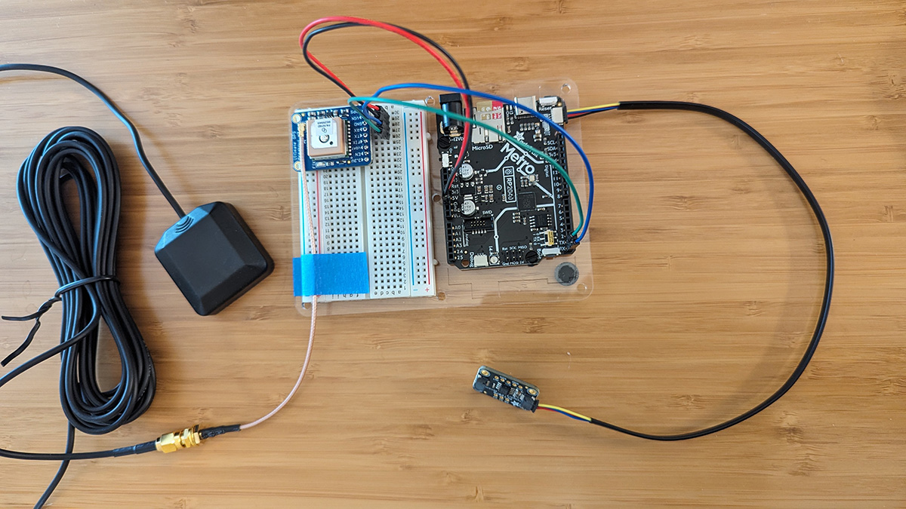
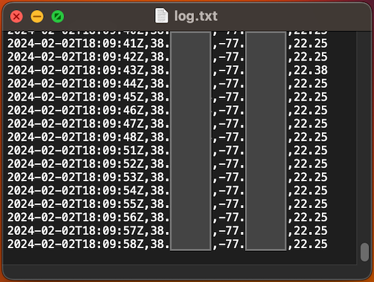

# MOLE (mapping of local environments)

## What is this?

More than 50% of people live in cities; the [World Bank](https://www.worldbank.org/en/topic/urbandevelopment/overview) estimates that continued urbanization trends mean that urban populations may double by 2050, at which point nearly 7 in 10 people will live in cities. The speed of urbanization results in challenges meeting the needs of residents, challenges that are exacerbated by climate change.

We want our cities to be green, resilient and inclusive. Achieving that goal requires intensive policy coordination and investment choices. We can empower communities to play an active role in their future by equipping them with data tools to understand their environment, inform their work, and enhance their advocacy efforts.

NOAA has [funded communities](https://www.heat.gov/pages/mapping-campaigns) to work with CAPA Strategies to do [Heat Watch](https://www.capastrategies.com/heat-watch) projects - community science field campaigns that output a set of high resolution air temperature and humidity data. That is awesome, and this project isn't meant to compete with it! However, we see value in creating and documenting a set of tools and methodologies that anyone can easily replicate and build on. We want communities to be able to begin to investigate the impacts of extreme heat regardless of funding and technical partnerships.

We're aware that there are some great hardware options available for purchase such as HabitatMap's [AirBeam](https://www.habitatmap.org/airbeam/buy-it-now). Options that don't require assembly 😬. However, the AirBeam is $249 and we think we can create something that works for our purpose for less. We want a device that doesn't require a companion app running on an adjacent smartphone to log location. We think there's value in learning how things work and in being able to tinker - so that you can try to fix things that break, or modify things to try and make it work better for you.

This is the early stage of an evolving project and we are looking for ideas, contributions, and feedback.

## Contributing

We would love your help on this project! Check out the [project board](https://github.com/orgs/AmericanRedCross/projects/2/views/1) for a list of items we've already started thinking about. If you have an idea that's not captured yet, go to the repository's [issues](https://github.com/AmericanRedCross/mapping-of-local-environments/issues/) and open a new issue. Reach out to daniel.joseph@redcross.org for more information or to chat about the project.

## Temperature mapper unit

### Component list

| Item  | Link |
| ------------- | ------------- |
| Adafruit Metro RP2040 | [$14.95](https://www.adafruit.com/product/5786) |
| Adafruit Ultimate GPS Breakout | [$29.95](https://www.adafruit.com/product/5440) |
| SMA to uFL/u.FL/IPX/IPEX RF Adapter Cable | [$3.95](https://www.adafruit.com/product/851) |
| GPS Antenna - External Active Antenna | [$19.95](https://www.adafruit.com/product/960) |
| Adafruit Sensirion SHT41 Temperature & Humidity Sensor - STEMMA QT / Qwiic | [$5.95](https://www.adafruit.com/product/5776) |
| STEMMA QT / Qwiic JST SH 4-Pin Cable - 300mm | [$1.25](https://www.adafruit.com/product/5384) |
| SD/MicroSD Memory Card - 16GB Class 10 | [$19.95](https://www.adafruit.com/product/2693) |
| PM2.5 Air Quality Sensor and Breadboard Adapter Kit - PMS5003 | [$39.95](https://www.adafruit.com/product/3686) |

**Options:**
- For an additional $7 you can replace the SHT41 Sensor with the [SHT45](https://www.adafruit.com/product/5665). The same code will work for both.
    - The SHT41 has an ±1.8% typical relative humidity accuracy from 25 to 75% and ±0.2 °C typical accuracy from 0 to 75 °C.
    - The SHT45 has an ±1.0% typical relative humidity accuracy from 25 to 75% and ±0.1°C typical accuracy from 0 to 75 °C.

**Additional components:**  
_(These are items that are either going to be phased out as the project matures, or that you may already have.)_
- male/male jumper wires (such as: Premium Male/Male Jumper Wires - 20 x 6" - [$4.95](https://www.adafruit.com/product/1957))
- breadboard (such as: Half Sized Premium Breadboard - [$4.95](https://www.adafruit.com/product/64))
- USB-C cable, with both power and data, that you can use to connect the Metro board to your computer and a power bank (such as: USB Type A to Type C Cable - [$4.95](https://www.adafruit.com/product/4474))
- power bank (specifications to be determined)

**Tools:**
- diagonal cutters (such as: Flush diagonal cutters - [$7.25](https://www.adafruit.com/product/152))
- solder wire (such as: Standard 60/40 lead/tin Rosin Core Solder which is easy to work with - [$7.95](https://www.adafruit.com/product/1886) - **IMPORTANT:** [Lead is a toxic metal](https://www.who.int/news-room/fact-sheets/detail/lead-poisoning-and-health) that can cause serious health problems. Avoid ingesting, keep away from children, and take proper precautions when working with materials containing lead. There is also [lead free solder](https://www.adafruit.com/product/1930) available.)
- soldering iron ([this guide](https://learn.adafruit.com/adafruit-guide-excellent-soldering) has notes on choosing an iron)

### Setup

#### Wiring things up

- Connect the PCT2075 Temperature Sensor to the Metro board using the STEMMA QT cable. The port on the Metro board is labeled (and there's only one it fits in). With the sensor oriented so that you can read the text printed on it, plug the cable into the left side port.
- The GPS breakout needs the headers cut to length and soldered on. If you're new to soldering, consider looking through the [Adafruit Guide To Excellent Soldering](https://learn.adafruit.com/adafruit-guide-excellent-soldering) by Bill Earl.
- Use a jumper wire to connect the `5V` on the Metro board to the `+` power rail of the breadboard.
- Use a jumper wire to connect the `Gnd` on the Metro board to the `-` power rail of the breadboard.
- Use the breadboard and jumper wires to connect the GPS breakout and Metro board:
  - `GND` on the breakout <--> `-` power rail of the breadboard
  - `▶VIN` on the breakout <--> `+` power rail of the breadboard
  - `▶RX` on the breakout <--> `RX` on the Metro board
  - `◀TX` on the breakout <--> `TX` on the Metro board
- Use the breadboard and jumper wires to connect the PM2.5 sensor and Metro board:
  - `VCC` on the sensor <--> `+` power rail of the breadboard
  - `GND` on the sensor  <--> `-` power rail of the breadboard
  - `TX` on the sensor <--> `25` on the Metro board
- Plug the microSD card into the Metro board.
- Attach the SMA to uFL Adapter Cable to the GPS breakout. **IMPORTANT:** Once you attach the adapter, it's suggested that you use strain relief to avoid ripping off the delicate connector.
- Connect the external GPS antenna to the other end of the adapter cable. 

#### Loading the code

- Connect the Metro board to your computer via the USB-C port.
- [Install the Mu editor](https://learn.adafruit.com/welcome-to-circuitpython/installing-mu-editor) on your computer. When downloading the latest stable version [for the Metro RP2040](https://circuitpython.org/board/adafruit_metro_rp2040/) note the version number. It is `8.2.9` at the time of writing this.
- [Install CircuitPython](https://learn.adafruit.com/welcome-to-circuitpython/installing-circuitpython) on the Metro board. Follow the instruction sections for RP2040 boards.
- Download the CircuitPython [library bundle](https://circuitpython.org/libraries) for your CircuitPython version. Match the version with the version of CircuitPython you installed. We looked for `8.x` in the filename.
- Unzip the library download, and from the `/lib/` folders copy the following files into the `/lib/` folder on your Metro board's drive:
  - adafruit_bus_device (this one is a folder)
  - adafruit_gps.mpy
  - adafruit_register (this one is also a folder)
  - adafruit_sdcard.mpy
  - adafruit_sht4x.mpy (for the temperature and humidity sensor)
  - adafruit_pm25 (this one is also a folder)
- Copy the `code.py` file from this repository to the home directory of the Metro board.

#### Running things

Right now, this is just bare bones! If the device is powered on and can get a GPS fix it will start logging a line every 1 second with the timestamp, geographic coordinates, and temperature. If you're connected to your computer and have the Mu edtior open you can view the lines it's logging via the serial console. You'll need to remove the SD card from the Metro board and plug it into your computer to access the log file.

#### Additional reading and resources

- [Welcome to CircuitPython!](https://learn.adafruit.com/welcome-to-circuitpython) by Adam Bachman 
- [Adafruit's CircuitPython mode sheet](https://learn.adafruit.com/mu-keyboard-shortcut-cheat-sheets#circuitpython-mode-cheat-sheet-3011142) for the Mu editor
- [Adafruit CircuitPython](https://docs.circuitpython.org) API documentation
- [Adafruit Metro RP2040](https://learn.adafruit.com/adafruit-metro-rp2040) by Kattni Rembor 
- [Adafruit Ultimate GPS](https://learn.adafruit.com/adafruit-ultimate-gps) by lady ada 
- [Adafruit GPS library](https://docs.circuitpython.org/projects/gps/en/latest/index.html) API technical documentation
- [Adafruit PCT2075 Temperature Sensor](https://learn.adafruit.com/adafruit-pct2075-temperature-sensor/) by Abigail Torres
- [PCT2075 Digital Temperature Sensor library](https://docs.circuitpython.org/projects/pct2075/) API technical documentation
- [Adafruit Sensirion SHT40, SHT41 & SHT45 Temperature & Humidity Sensors](https://learn.adafruit.com/adafruit-sht40-temperature-humidity-sensor) By Kattni Rembor 
- [PM2.5 Air Quality Sensor](https://learn.adafruit.com/pm25-air-quality-sensor) by lady ada

