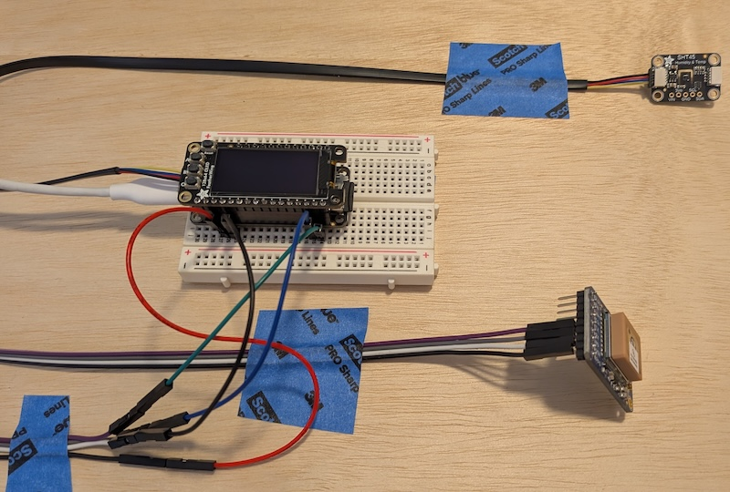
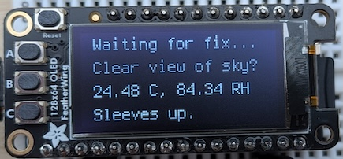
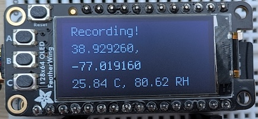
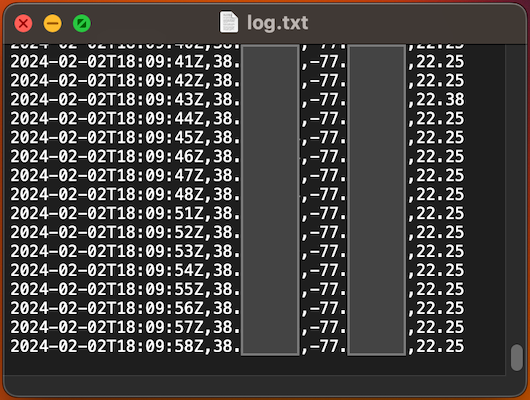
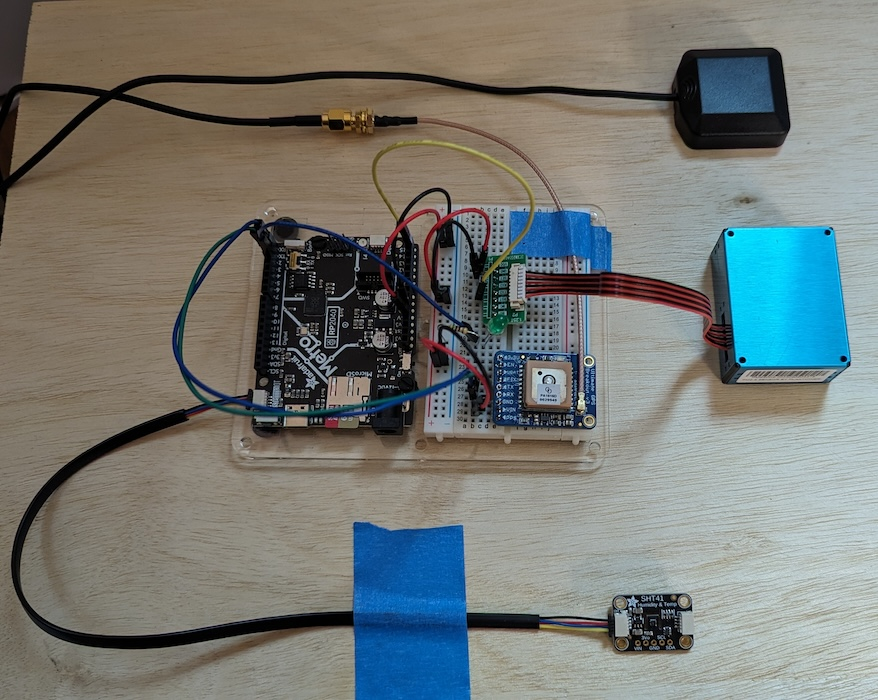

# Mobile logger for community science urban heat island mapping

We aim to have multiple versions based on different boards. Currently we've experimented with...
- [[1] Adafruit Feather RP2040 Adalogger](https://github.com/AmericanRedCross/mapping-of-local-environments/tree/main/mobile-logger#1-adafruit-feather-rp2040-adalogger) - this one is the nearest to being complete
- [[2] Raspberry Pi Zero](https://github.com/AmericanRedCross/mapping-of-local-environments/tree/main/mobile-logger#2-raspberry-pi-zero)
- [[3] Adafruit Metro RP2040](https://github.com/AmericanRedCross/mapping-of-local-environments/tree/main/mobile-logger#3-adafruit-metro-rp2040)

## [1] Adafruit Feather RP2040 Adalogger

⚠️ This is a work in progress

### Component list

## Core items
| Item  | Link |
| ------------- | ------------- |
| Adafruit Feather RP2040 Adalogger | $14.95 [from Adafruit](https://www.adafruit.com/product/5980) |
| Adafruit Mini GPS PA1010D - UART and I2C - STEMMA QT | $29.95 [from Adafruit](https://www.adafruit.com/product/4415) |
| Adafruit Sensirion SHT45 Temperature & Humidity Sensor - STEMMA QT / Qwiic (with PTFE filter) | $13.50 [from Adafruit](https://www.adafruit.com/product/5665) |
| QT to QT Cable - 400mm | $1.50 [from Adafruit](https://www.adafruit.com/product/5385) |
| QT to QT Cable - 200mm | $1.25 [from Adafruit](https://www.adafruit.com/product/4401) |
| MicroSD Memory Card - 8GB | $23.50 [from Adafruit](https://www.adafruit.com/product/1294) |
| USB C to USB C Cable - 1m | $9.95 [from Adafruit](https://www.adafruit.com/product/4199) |
| Power bank w/ USB-C port [⚠️TODO: recommend capacity] | [⚠️TODO: example source] |

## Additional items for NeoPixel version
| Item  | Link |
| ------------- | ------------- |
| Breadboard-friendly RGB Smart NeoPixel - Pack of 5 | $7.95 [from Adafruit](https://www.adafruit.com/product/1312) |
| Solid-Core Wire - 22AWG | $2.95 for 25ft [from Adafruit](https://www.adafruit.com/product/290) |

## Additional items for OLED display version
| Item  | Link |
| ------------- | ------------- |
| Adafruit 128x64 OLED FeatherWing - Pre-Soldered | $15.95 [from Adafruit](https://www.adafruit.com/product/6313) |
| Stacking Headers for Feather - 12-pin and 16-pin female headers | $1.25 [from Adafruit](https://www.adafruit.com/product/2830) |

**General notes:**  
- If buying from Adafruit they offer discounts when buying quantities greater than 10.
- To save $8 you can replace the SHT45 Sensor with the SHT41 ([$5.95 from Adafruit](https://www.adafruit.com/product/5776)). The same code will work for both.
    - The SHT41 has an ±1.8% typical relative humidity accuracy from 25 to 75% and ±0.2 °C typical accuracy from 0 to 75 °C.
    - The SHT45 has an ±1.0% typical relative humidity accuracy from 25 to 75% and ±0.1°C typical accuracy from 0 to 75 °C. Also, the SHT45 has the optional PTFE filter membrane that provides an additional barrier for all pollutants to enter the sensor opening, thus lowering negative influences on the sensing element. The membrane has a thickness of 100 µm offering a filtration efficiency of >99.99% for particles of 200 nm size and larger. Owing to the high permeability and the small volume between sensing element and membrane, the specified response time of the RH sensor is unaltered. 

**NeoPixel version notes:**
    - For the Neopixel version you can buy 3 colors of wire - red, black, white for power, ground, and data - but it is not required.
    - ⚠️TODO: Estimate how much wire each unit uses.

**OLED display version notes:**  
- To save $1 you can buy the OLED Featherwing with soldering required and solder the headers yourself.

**Tools:**
- Solder wire - such as: Standard 60/40 lead/tin Rosin Core Solder which is easy to work with - $7.95 [from Adafruit](https://www.adafruit.com/product/1886).
    - **🚨 WARNING:** [Lead is a toxic metal](https://www.who.int/news-room/fact-sheets/detail/lead-poisoning-and-health) that can cause serious health problems. Work in a well ventilated area, avoid ingesting, keep away from children, and take proper precautions when working with materials containing lead. There is also [lead free solder](https://www.adafruit.com/product/1930) available.
- Soldering iron ([this guide](https://learn.adafruit.com/adafruit-guide-excellent-soldering) has notes on choosing an iron).
- Safety glasses.

### Setup

- If using the OLED display, solder the Stacking Headers onto the Adalogger board. If you're new to soldering, consider looking through the [Adafruit Guide To Excellent Soldering](https://learn.adafruit.com/adafruit-guide-excellent-soldering) by Bill Earl.
- [Install the Mu editor](https://learn.adafruit.com/welcome-to-circuitpython/installing-mu-editor) on your computer. 
- [Install CircuitPython](https://learn.adafruit.com/adafruit-feather-rp2040-adalogger/install-circuitpython) on the Adalogger board. 
    - When downloading the latest stable version of [CircuitPython for the Adalogger](https://circuitpython.org/board/adafruit_feather_rp2040_adalogger/) note the version number. It is `10.2.1` at the time of writing this.
    - https://circuitpython.org/board/adafruit_feather_rp2040_adalogger/
    - **Note:** One of the steps requires pressing the 2 buttons on the board which will be covered by the OLED Featherwing. That's why we are doing this now and not wiring everything up first.
- Make sure the `CIRCUITPY` drive that shows up on your computer contains a `/lib/` folder and `/sd/` folder.
- Download the CircuitPython [library bundle](https://circuitpython.org/libraries) for your CircuitPython version. Match the version with the version of CircuitPython you installed. We installed `10.2.1` so looked for "Bundle for Version 10.x".
- Unzip the library download, and from the `/lib/` folders copy the following files into the `/lib/` folder on your Metro board's drive:
    - For both versions:
        - adafruit_gps.mpy
        - adafruit_sht4x.mpy
    - For NeoPixel version:
        - neopixel.mpy
    - For OLED display version:
        - adafruit_bus_device (this is a folder)
        - adafruit_display_text (this is a folder)
        - adafruit_displayio_sh1107.mpy
        - ⚠️TODO: check these dependencies
- Copy the either `code-Adafruit_Feather_RP2040_Adalogger_NeoPixel.py` or `code-Adafruit_Feather_RP2040_Adalogger_OLED.py` file (depending on which version you are building) from this repository to the home directory of the Metro board and rename it to just `code.py`.
- Unplug the board from your computer.
- Insert the SD card into the slot on the end of the Adalogger board.
- If using the OLED display, stack the OLED FeatherWing on top of the Adalogger board by carefully lining up the pins with the ports and pushing them together gently and evenly.
- Connect the Mini GPS to either the I2C port on the Adalogger board - or if using the OLED display, the I2C port on the end of the OLED FeatherWing (the port on the FeatherWing is next to the buttons, and there's only one) - using the 200mm QT cable. Plug the cable into the left side of the Mini GPS when the GPS is oriented so that you can read the text printed on it.
- Connect the SHT41/45 Sensor to the Mini GPS using the 400mm QT cable. The cable should start at the right side of the Mini GPS and plug into the left side of the sensor when the sensor is oriented so that you can read the text printed on it.

  
_(This picture shows the components connected using a different GPS module and a prototyping breadboard. It is not the final configuration.)_

#### Running things

If the device is powered on and can get a GPS fix it will start logging a line every 1 second with the timestamp, geographic coordinates, and temperature. It will show the status on the screen. If you're connected to your computer and have the Mu edtior open you can also view the lines it's logging via the serial console. **NOTE:** You'll need to remove the SD card from the board and plug it into your computer to access the log file.

  
_(Before a GPS location fix, and then with a GPS location fix and recording data.)_

  
_(An example of the type of data file output.)_

#### Additional reading and resources

- Guide for the [Adafruit Feather RP2040 Adalogger](https://learn.adafruit.com/adafruit-feather-rp2040-adalogger) by Liz Clark
- Guide for the [Adafruit 128x64 OLED FeatherWing](https://learn.adafruit.com/adafruit-128x64-oled-featherwing) by Kattni Rembor
- Guide for the [Adafruit Sensirion SHT40, SHT41 & SHT45 Temperature & Humidity Sensors](https://learn.adafruit.com/adafruit-sht40-temperature-humidity-sensor/overview) by Kattni Rembor
- Guide for the [Adafruit Ultimate GPS](https://learn.adafruit.com/adafruit-ultimate-gps) by lady ada 
- API technical documentation for the [Adafruit GPS library](https://docs.circuitpython.org/projects/gps/en/latest/index.html) 
- [Welcome to CircuitPython!](https://learn.adafruit.com/welcome-to-circuitpython) by Adam Bachman 
- [Adafruit's CircuitPython mode sheet](https://learn.adafruit.com/mu-keyboard-shortcut-cheat-sheets#circuitpython-mode-cheat-sheet-3011142) for the Mu editor
- Documentation for [Adafruit CircuitPython](https://docs.circuitpython.org) 

## [2] Raspberry Pi Zero 

**⚠️ Have not gotten this version to work yet**

This build pulls heavily from the [Meteobike project](https://github.com/achristen/Meteobike).

### Component list

| Component | Model | Price |
| ------------------ | ----------- | ----------- |
| Microcontroller | Raspberry Pi Zero | $ |
| GPS | Adafruit Ultimate GPS Breakout | $ |
| Temperature / humidity sensor |  | $ |
| Micro SD card |  |  $ |
| Powerbank | | $ |
| Jumper wires | |  $ |
| Screen | 2.7inch e-Paper HAT | $ | 

## [3] Adafruit Metro RP2040

⚠️ Work in progress

### Component list

| Item  | Link |
| ------------- | ------------- |
| Adafruit Metro RP2040 | [$14.95](https://www.adafruit.com/product/5786) |
| Adafruit Ultimate GPS Breakout | [$29.95](https://www.adafruit.com/product/5440) |
| SMA to uFL/u.FL/IPX/IPEX RF Adapter Cable | [$3.95](https://www.adafruit.com/product/851) |
| GPS Antenna - External Active Antenna | [$19.95](https://www.adafruit.com/product/960) |
| Adafruit Sensirion SHT41 Temperature & Humidity Sensor - STEMMA QT / Qwiic | [$5.95](https://www.adafruit.com/product/5776) |
| STEMMA QT / Qwiic JST SH 4-Pin Cable - 300mm | [$1.25](https://www.adafruit.com/product/5384) |
| SD/MicroSD Memory Card - 16GB Class 10 | [$19.95](https://www.adafruit.com/product/2693) |
| PM2.5 Air Quality Sensor and Breadboard Adapter Kit - PMS5003 | [$39.95](https://www.adafruit.com/product/3686) |

**Options:**
- For an additional $7 you can replace the SHT41 Sensor with the [SHT45](https://www.adafruit.com/product/5665). The same code will work for both.
    - The SHT41 has an ±1.8% typical relative humidity accuracy from 25 to 75% and ±0.2 °C typical accuracy from 0 to 75 °C.
    - The SHT45 has an ±1.0% typical relative humidity accuracy from 25 to 75% and ±0.1°C typical accuracy from 0 to 75 °C.

**Additional components:**  
_(These are items that are either going to be phased out as the project matures, or that you may already have.)_
- male/male jumper wires (such as: Premium Male/Male Jumper Wires - 20 x 6" - [$4.95](https://www.adafruit.com/product/1957))
- breadboard (such as: Half Sized Premium Breadboard - [$4.95](https://www.adafruit.com/product/64))
- USB-C cable, with both power and data, that you can use to connect the Metro board to your computer and a power bank (such as: USB Type A to Type C Cable - [$4.95](https://www.adafruit.com/product/4474))
- power bank (specifications to be determined)

**Tools:**
- diagonal cutters (such as: Flush diagonal cutters - [$7.25](https://www.adafruit.com/product/152))
- solder wire (such as: Standard 60/40 lead/tin Rosin Core Solder which is easy to work with - [$7.95](https://www.adafruit.com/product/1886) - **IMPORTANT:** [Lead is a toxic metal](https://www.who.int/news-room/fact-sheets/detail/lead-poisoning-and-health) that can cause serious health problems. Avoid ingesting, keep away from children, and take proper precautions when working with materials containing lead. There is also [lead free solder](https://www.adafruit.com/product/1930) available.)
- soldering iron ([this guide](https://learn.adafruit.com/adafruit-guide-excellent-soldering) has notes on choosing an iron)

### Setup

#### Wiring things up

- Connect the PCT2075 Temperature Sensor to the Metro board using the STEMMA QT cable. The port on the Metro board is labeled (and there's only one it fits in). With the sensor oriented so that you can read the text printed on it, plug the cable into the left side port.
- The GPS breakout needs the headers cut to length and soldered on. If you're new to soldering, consider looking through the [Adafruit Guide To Excellent Soldering](https://learn.adafruit.com/adafruit-guide-excellent-soldering) by Bill Earl.
- Use a jumper wire to connect the `5V` on the Metro board to the `+` power rail of the breadboard.
- Use a jumper wire to connect the `Gnd` on the Metro board to the `-` power rail of the breadboard.
- Use the breadboard and jumper wires to connect the GPS breakout and Metro board:
  - `GND` on the breakout <--> `-` power rail of the breadboard
  - `▶VIN` on the breakout <--> `+` power rail of the breadboard
  - `▶RX` on the breakout <--> `RX` on the Metro board
  - `◀TX` on the breakout <--> `TX` on the Metro board
- Use the breadboard and jumper wires to connect the PM2.5 sensor and Metro board:
  - `VCC` on the sensor <--> `+` power rail of the breadboard
  - `GND` on the sensor  <--> `-` power rail of the breadboard
  - `TX` on the sensor <--> `25` on the Metro board
- Plug the microSD card into the Metro board.
- Attach the SMA to uFL Adapter Cable to the GPS breakout. **IMPORTANT:** Once you attach the adapter, it's suggested that you use strain relief to avoid ripping off the delicate connector.
- Connect the external GPS antenna to the other end of the adapter cable. 

  
_(Please ignore the LED shown wired into the breadboard, it is part of testing for an indicator light that is not yet included in the instructions.)_

#### Loading the code

- Connect the Metro board to your computer via the USB-C port.
- [Install the Mu editor](https://learn.adafruit.com/welcome-to-circuitpython/installing-mu-editor) on your computer. When downloading the latest stable version [for the Metro RP2040](https://circuitpython.org/board/adafruit_metro_rp2040/) note the version number. It is `8.2.9` at the time of writing this.
- [Install CircuitPython](https://learn.adafruit.com/welcome-to-circuitpython/installing-circuitpython) on the Metro board. Follow the instruction sections for RP2040 boards.
- Download the CircuitPython [library bundle](https://circuitpython.org/libraries) for your CircuitPython version. Match the version with the version of CircuitPython you installed. We looked for `8.x` in the filename.
- Unzip the library download, and from the `/lib/` folders copy the following files into the `/lib/` folder on your Metro board's drive:
  - adafruit_bus_device (this one is a folder)
  - adafruit_gps.mpy
  - adafruit_register (this one is also a folder)
  - adafruit_sdcard.mpy
  - adafruit_sht4x.mpy (for the temperature and humidity sensor)
  - adafruit_pm25 (this one is also a folder)
- Copy the `code-Metro_RP2040.py` file from this repository to the home directory of the Metro board and rename it to `code.py`.

#### Running things

Right now, this is just bare bones! If the device is powered on and can get a GPS fix it will start logging a line every 1 second with the timestamp, geographic coordinates, and temperature. If you're connected to your computer and have the Mu edtior open you can view the lines it's logging via the serial console. You'll need to remove the SD card from the Metro board and plug it into your computer to access the log file.

#### Additional reading and resources

- [Welcome to CircuitPython!](https://learn.adafruit.com/welcome-to-circuitpython) by Adam Bachman 
- [Adafruit's CircuitPython mode sheet](https://learn.adafruit.com/mu-keyboard-shortcut-cheat-sheets#circuitpython-mode-cheat-sheet-3011142) for the Mu editor
- [Adafruit CircuitPython](https://docs.circuitpython.org) API documentation
- [Adafruit Metro RP2040](https://learn.adafruit.com/adafruit-metro-rp2040) by Kattni Rembor 
- [Adafruit Ultimate GPS](https://learn.adafruit.com/adafruit-ultimate-gps) by lady ada 
- [Adafruit GPS library](https://docs.circuitpython.org/projects/gps/en/latest/index.html) API technical documentation
- [Adafruit Sensirion SHT40, SHT41 & SHT45 Temperature & Humidity Sensors](https://learn.adafruit.com/adafruit-sht40-temperature-humidity-sensor) By Kattni Rembor 
- [PM2.5 Air Quality Sensor](https://learn.adafruit.com/pm25-air-quality-sensor) by lady ada
